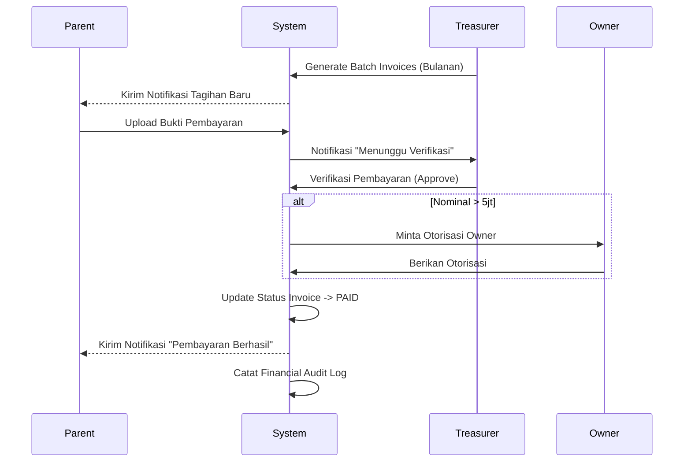

# Review Sistem Interaksi Entitas - Field Connected

## 1. Analisis Hubungan & Alur Kerja

### A. Player ↔ Coach (Training & Evaluation)
*   **Alur**: Pelatih mencatat kehadiran dan memberikan evaluasi berkala kepada pemain.
*   **Evaluasi**:
    *   **Kekuatan**: Terpusat dan dapat diakses langsung oleh orang tua.
    *   **Kelemahan**: Pengisian evaluasi masih bersifat manual dan belum ada pengingat otomatis bagi pelatih.
    *   **Rekomendasi**: Implementasi "Training Plan" yang dapat dikomentari oleh pemain/orang tua.

### B. Player ↔ Parent (Monitoring & Payment)
*   **Alur**: Orang tua memantau perkembangan dan melakukan pembayaran tagihan anak.
*   **Evaluasi**:
    *   **Kekuatan**: Mobile-first, memudahkan orang tua melihat progres riil.
    *   **Kelemahan**: Verifikasi pembayaran manual oleh bendahara seringkali menjadi bottleneck.
    *   **Rekomendasi**: Integrasi Payment Gateway untuk verifikasi otomatis dan update status instan.

### C. Player ↔ Treasurer (Invoice Handling)
*   **Alur**: Bendahara menerbitkan tagihan (SPP, registrasi) untuk pemain.
*   **Evaluasi**:
    *   **Kekuatan**: Batch processing mengurangi beban kerja administratif.
    *   **Kelemahan**: Belum ada sistem penalti otomatis untuk keterlambatan pembayaran.
    *   **Rekomendasi**: Sistem "Auto-Overdue" yang mengubah status tagihan dan mengirimkan notifikasi peringatan.

### D. Coach ↔ Owner (Performance Reporting)
*   **Alur**: Pemilik memantau kinerja pelatih melalui dashboard strategis.
*   **Evaluasi**:
    *   **Kekuatan**: Transparansi penuh terhadap lisensi dan kehadiran pelatih.
    *   **Kelemahan**: Belum ada mekanisme reward/punishment berbasis data.
    *   **Rekomendasi**: "Coach Analytics" yang menggabungkan tingkat kehadiran pelatih dengan tingkat kemajuan pemain.

### E. Treasurer ↔ Owner (Financial Reporting)
*   **Alur**: Bendahara mengelola keuangan dan melaporkannya kepada Pemilik.
*   **Evaluasi**:
    *   **Kekuatan**: Audit trail mencatat setiap perubahan data sensitif.
    *   **Kelemahan**: Limit transaksi belum ditegakkan secara sistemik di level database.
    *   **Rekomendasi**: "Hard-lock approval" untuk pengeluaran di atas limit tertentu yang mewajibkan approval Owner.

---

## 2. Diagram Sequence: Siklus Pembayaran & Verifikasi

---

## 3. Matriks Tanggung Jawab (RACI)

| Aktivitas | Player | Coach | Parent | Treasurer | Owner |
|-----------|:---:|:---:|:---:|:---:|:---:|
| Pencatatan Kehadiran | I | R/A | I | - | C |
| Evaluasi Performa | I | R/A | C | - | C |
| Penerbitan Invoice | - | - | I | R/A | C |
| Pembayaran Tagihan | - | - | R/A | I | I |
| Verifikasi Pembayaran | - | - | I | R/A | C |
| Approval Anggaran | - | - | - | C | R/A |
| Manajemen Data Master | - | C | - | C | R/A |

*R = Responsible, A = Accountable, C = Consulted, I = Informed*

---

## 4. Mekanisme Validasi & Keamanan

### Otorisasi (RLS Policies)
Setiap tabel menggunakan Supabase RLS untuk memastikan:
- **Parent**: Hanya melihat data `player_id` yang terhubung di `parent_players`.
- **Coach**: Hanya dapat mengedit kehadiran/evaluasi tim yang ditugaskan.
- **Treasurer**: Akses penuh ke data keuangan tetapi *read-only* untuk data personal pemain.
- **Owner**: Akses *Super Admin* dengan audit trail wajib.

### Audit Trail
Tabel `financial_audit_logs` dan `coach_account_logs` mencatat:
- User ID yang melakukan aksi.
- Timestamp UTC+7.
- Payload data sebelum dan sesudah (JSONB).
- IP Address/Device info (opsional via Edge Functions).

---

## 5. Rekomendasi Perbaikan (Best Practice)

1.  **Automated Billing**: Menggunakan Edge Functions (CRON) untuk menerbitkan invoice pada tanggal 1 setiap bulan berdasarkan status pemain.
2.  **Payment OCR**: Implementasi integrasi API Vision untuk validasi bukti transfer awal sebelum verifikasi manual bendahara.
3.  **Encrypted Sensitive Data**: Menggunakan `pgsodium` untuk enkripsi data NIK dan Nomor Rekening di level database.
4.  **API Versioning**: Memastikan seluruh endpoint `/v1/*` memiliki dokumentasi OpenAPI 3.0 yang up-to-date.
